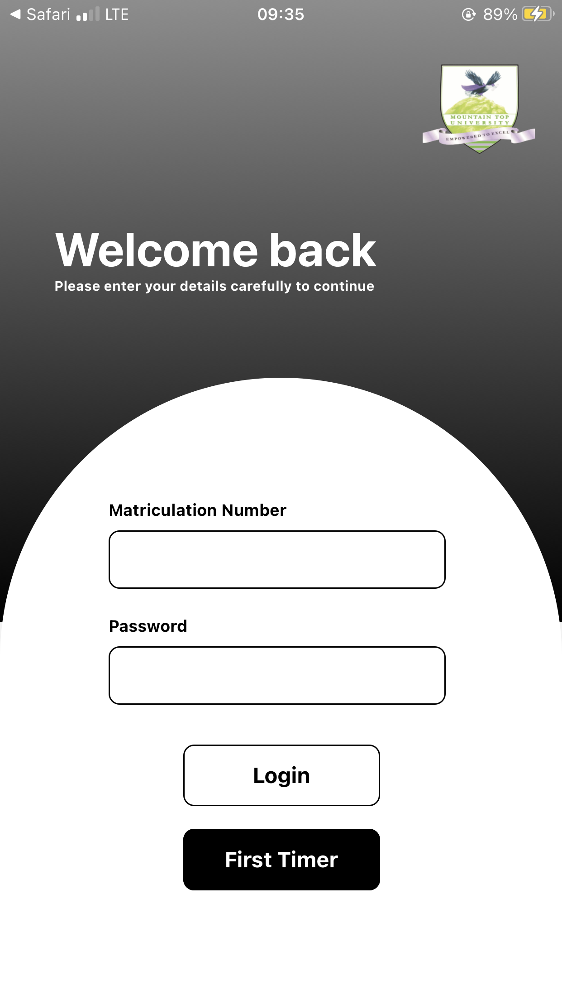

# Contactless-Id-Card

Contactless ID Card app: Transforming campus transactions with ease. Seamlessly secure and cashless experience for students

# Installation requirements

You must have this before installation, remember this is a expo-react-native project

- Node.js (Very Important)
- gitbash/git to run in terminal
- visual studio code/sublime text
- npm
- expo go

# Installation Codes

These are the necessary installations for the node package manager

- npm install

  # Run Guide

  On the terminal, type:

- npm start
- Once the metro bundler is started use ios or android and scan the qr code
- Congratulations The app is installed
